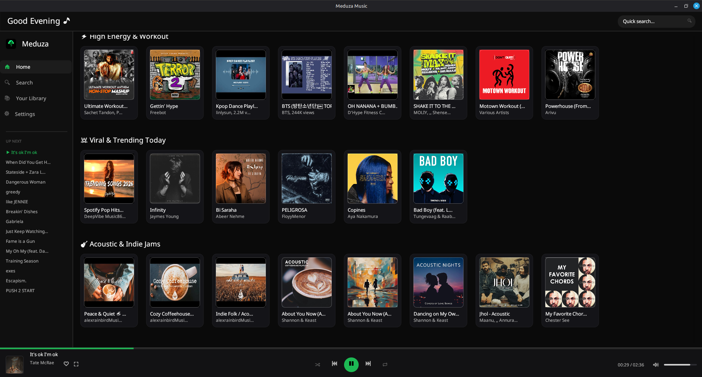
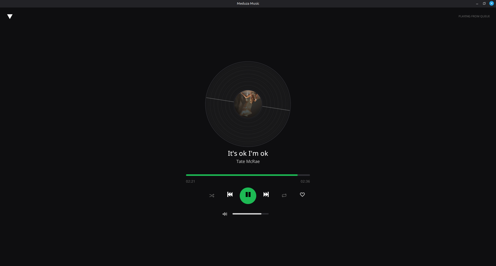
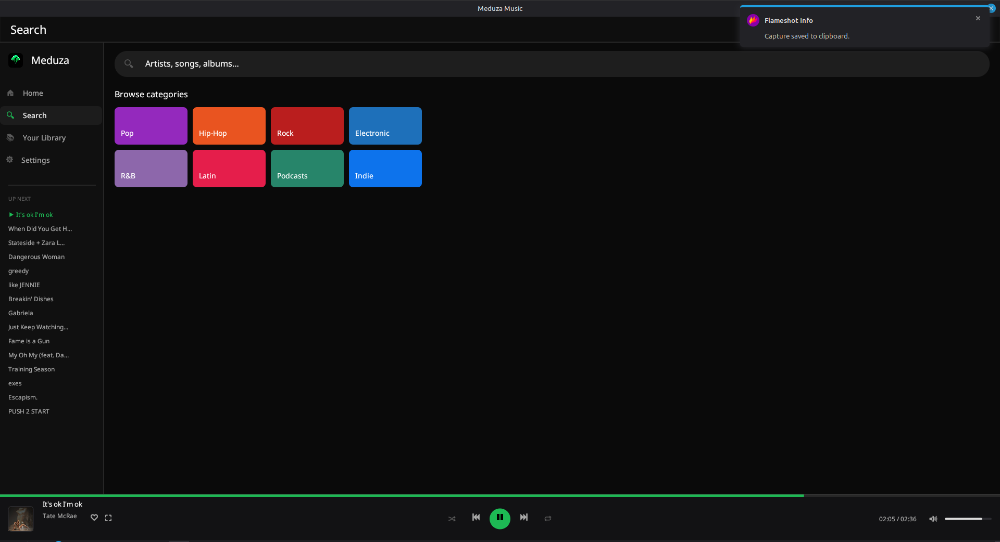
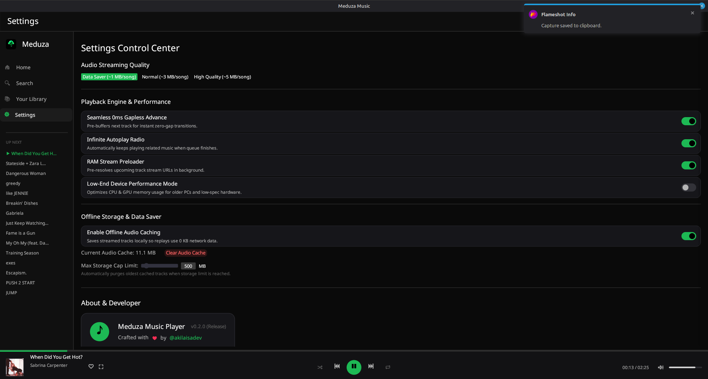
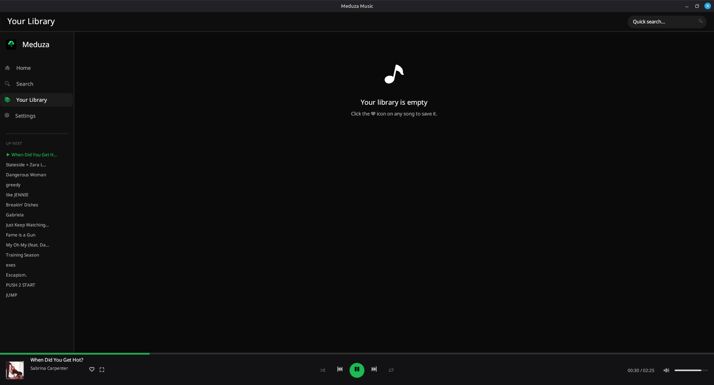

# 🎵 Meduza Music

<p align="center">
  
</p>

<p align="center">
  <b>A fast, native, lightweight desktop YouTube Music player for Linux.</b><br />
  <i>Crafted with Rust, egui, and MPV for smooth audio streaming, zero lag, and minimal resource usage.</i>
</p>

<p align="center">
  <a href="https://github.com/akilaisadev/meduza-music/releases/latest"></a>
  <a href="https://github.com/akilaisadev/meduza-music/stargazers"></a>
  
  
</p>

---

## 📸 Interface Showcase

### 🏠 Home Discovery Feed
Personalized shelves (*Jump back in*, *Heavy rotation*, *Listening history*, *Top Artists & Mixes*) with high-contrast, always-visible scrollbar UI.



<br />

### 💿 Full-Screen Player & Search
Cinematic full-screen player with spinning vinyl record disc animation, alongside instant category browsing.

| 🎵 Cinematic Player | 🔍 Instant Category Search |
|---|---|
|  |  |

<br />

### ⚙️ Settings Control Center & 💚 Library
Toggle low-end hardware mode, seamless 0ms gapless preloader, offline caching, and manage your saved library.

| ⚙️ Performance & Settings | 💚 Your Library |
|---|---|
|  |  |

---

## ✨ Features

- ⚡ **Extreme Native Performance**: Written 100% in Rust using `egui` and `tokio`. Consumes **<40 MB RAM** (vs 500 MB+ in Electron players).
- 🎧 **YouTube Music Engine**: Stream millions of songs, albums, and playlists directly via InnerTube API.
- 🏠 **Smart Home Feed**: Dynamically adapts to your top artists and genres with instant offline session caching.
- 🔊 **Zero-Latency MPV Player**: Pre-buffers next tracks in background memory for instant gapless transitions.
- 💾 **Offline Data Saver**: Option to cache played tracks locally for 0-data replays.
- 🎨 **Glassmorphic Modern UI**: Dark mode UI with custom visual scrollbars, album art caching, and audio spectrum vinyl animations.
- 🖥️ **System Tray Integration**: Minimize to tray with system notifications (`org.kde.StatusNotifierWatcher`).

---

## 🚀 Installation & Usage

### Option 1: AppImage (Recommended)

Download the latest `MeduzaMusic-*-x86_64.AppImage` from the [Releases Page](https://github.com/akilaisadev/meduza-music/releases/latest) and run:

```bash
# 1. Make it executable
chmod +x Meduza_Music-*-x86_64.AppImage

# 2. Launch Meduza Music
./Meduza_Music-*-x86_64.AppImage
```

AppImages are self-contained and do not require installation. Requires `mpv`, `python3` with `yt_dlp`, the GTK3 runtime, and FUSE (already present on most modern distros).

### Option 2: Build from Source (Cargo)

Prerequisites: `cargo`, `mpv`, `python3` + `yt-dlp`, `gtk3`.

```bash
# 1. Clone the repository
git clone https://github.com/akilaisadev/meduza-music.git
cd meduza-music

# 2. Build and run in release mode
cargo run --release
```

### Option 3: Package an AppImage yourself

```bash
./build_appimage.sh
```

---

## 🛠 Tech Stack & Architecture

| Component | Technology | Role |
|---|---|---|
| **GUI Framework** | `eframe` / `egui` 0.26 | High-performance, GPU-accelerated immediate mode GUI |
| **Audio Backend** | `mpv` IPC | Native socket IPC control for low latency stream playback |
| **API Client** | `InnerTube` (Async) | YouTube Music API fetching with LRU image & track caching |
| **Async Runtime** | `tokio` 1.0 | Background pre-loading, audio stream resolving & caching |
| **Data Persistence** | `serde_json` + `dirs` | Local home feed & settings JSON persistence |

---

## ⚡ Performance Comparison

| Feature | Meduza Music (Rust) | Typical Electron Player |
|---|---|---|
| **RAM Usage** | **35 – 45 MB** | 450 – 800 MB |
| **Startup Time** | **< 0.2 seconds** | 2.5 – 4.0 seconds |
| **CPU Usage** | **< 1% idling** | 4 – 8% idling |
| **Package Size** | **~16 MB** | ~120 MB |

---

## 🤝 Contributing & License

Contributions, bug reports, and feature requests are welcome! Feel free to check out the [Issues](https://github.com/akilaisadev/meduza-music/issues).

Distributed under the MIT License. Crafted with ❤️ by [@akilaisadev](https://github.com/akilaisadev).
